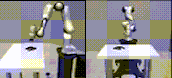

# Active-Gym

<p float="left">
    
    
</p>


Active-Gym is a collection of environments for **Active Vision Reinforcement Learning**. It builds on top of existing common visual RL environments including [Atari](https://github.com/openai/atari-py), [DeepMind Control suite](https://github.com/deepmind/dm_control), and [Robosuite](https://github.com/ARISE-Initiative/robosuite). All environments are compatible with [Gymasium](https://github.com/Farama-Foundation/Gymnasium) interface.

What is Active(Vision)-RL?
It is a process that allows an embodied agent to actively gather new information in an environment. This library particularly focuses on actively managing visual observations, for example an image crop in a 2D environment or a viewpoint in a 3D environment. The agent takes motor actions (like manipulations, physical interactions) and sensory actions (like eye movements) together to finish a task.

## Change Logs
- 2023/12/27: Added support for RLBench. Version number 0.1 -> 0.2.
    * TODO: may need to fix camera movement in RLBench
- 2023/08: Added support for Robosuite.

## Installation

`pip install git+https://github.com/elicassion/active-gym.git`

or clone and install it in editable mode

```
git clone https://github.com/elicassion/active-gym.git
cd active-gym
pip install -e .
```

If you are interested in using robot environments (like Robosuite), you can do
```
pip install git+https://github.com/elicassion/active-gym.git[robosuite]
```
or follow the installation of [Robosuite](https://github.com/ARISE-Initiative/robosuite)

## Quick Start
### Atari
```
from active_gym import AtariBaseEnv, AtariEnvArgs
env_args = AtariEnvArgs(
    game=env_name, 
    seed=seed, 
    obs_size=(84, 84), 
    fov_size=(30, 30),               # the partial observation size
    fov_init_loc=(0, 0),             # the initial partial observation location
    sensory_action_mode="absolute",  # change the observation location by abs coordinates
    record=False,                    # it integrates recording, if needed
)
env = AtariFixedFovealEnv(env_args)
obs, info = env.reset()
for i in range(5):
    obs, reward, done, truncated, info = env.step(env.action_space.sample())
    # action is in the form of gymnasium.spaces.Dict
    # {"motor_action": np.ndarray, "sensory_action": np.ndarray}
```

### Robosuite
```
from active_gym import make_active_robosuite_env, RobosuiteEnvArgs
from robosuite.controllers import load_controller_config
env_args = RobosuiteEnvArgs(
    task=task_name,                 # task name like "Lift"
    seed=seed,                      # random seed
    obs_size=(84, 84),              # observation resolution
    robots=["Panda", "Panda"] if "TwoArm" in task_name else "Panda",              # robot config
    controller_configs = load_controller_config(default_controller="OSC_POSE")    # optionally change the controller
    camera_names=["sideview", "active_view", "agentview"],                        # views available in simulation
    selected_obs_names=["sideview_image", "active_view_image", "agentview_image"] # selected observation returned in observation, must be a subset of <camera_names>
    init_view="sideview",           # where to initialize the active camera, the selected one should be presented in <camera_names>
    **kwargs
)
env = make_active_robosuite_env(env_args)
obs, info = env.reset()
# obs["active_view_image"]          # the image observation from active_view
for i in range(5):
    obs, reward, done, truncated, info = env.step(env.action_space.sample())
    # action is in the form of gymnasium.spaces.Dict
    # {"motor_action": np.ndarray, "sensory_action": np.ndarray}
```

More examples can be found at `if __name__ == "__main__"` part in `atari_env.py`, `dmc_env.py`, and `robosuite_env.py`.

## Supported Types of Environments
- Atari
```
AtariBaseEnv                        # Base environment with full observation
AtariFixedFovealEnv                 # Active environment with limited foveal visual observation, at fixed size
AtariFlexibleFovealEnv              # Active environment with options to change foveal observation size
AtariFixedFovealPeripheralEnv       # Active environment with both foveal and peripheral observations
```

- DMC
```
DMCBaseEnv
DMCFixedFovealEnv
DMCFlexibleFovealEnv
DMCFixedFovealPeripheralEnv
```

- Robosuite
```
# All robosuite environments are supported by adding a movable camera.
from active_gym import make_active_robosuite_env
make_active_robosuite_env(task="<robosuite_env_name>", <more_args>)
```

- RLBench
```
make_active_rlbench_env(task="<rlbench_env_name>", <more_args>)
```

Note: `frame stacking` and `action repeat` are intergrated in Atari and DMC environments.

## TODO List
All suggestions on bug-fix, new features, and improvmets are welcomed. Please open an issue or contact jishang\[at\]cs.stonybrook.edu
- [ ] Issac Gym
- [x] RLBench
- [x] Robosuite

## Citation
Please consider cite us if you find this repo helpful.
```
@article{shang2023active,
    title={Active Reinforcement Learning under Limited Visual Observability},
    author={Jinghuan Shang and Michael S. Ryoo},
    journal={arXiv preprint},
    year={2023},
    eprint={2306.00975},
}
```

## Acknowledgement
We thank the implementation of the base environments used in this repo: [Atari](https://github.com/openai/atari-py), [DeepMind Control suite](https://github.com/deepmind/dm_control), [Robosuite](https://github.com/ARISE-Initiative/robosuite), and [dmc2gym](https://github.com/denisyarats/dmc2gym).
